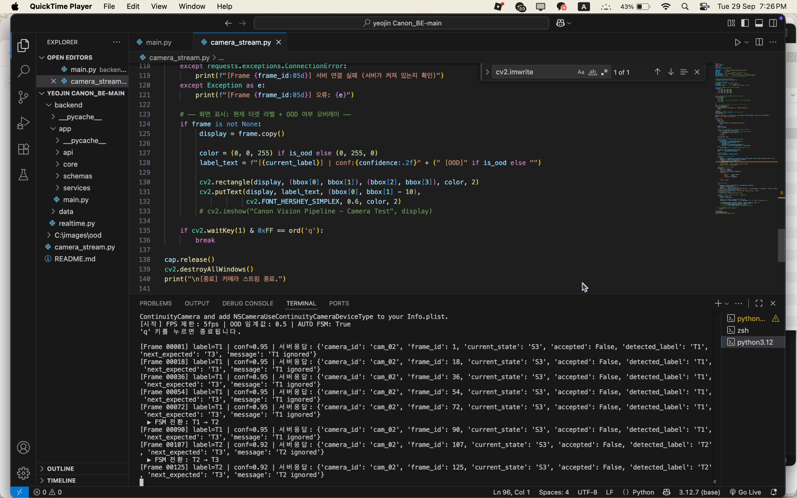

# CANON — Industrial Computer Vision Frontend

## Overview

CANON is a real-time industrial computer vision system developed as a team project.

The system combines computer vision, object detection, OOD detection, and sequence control for monitoring industrial processes.

This repository showcases my contribution to the project: the frontend interface used to visualize and interact with the system.

## My Contribution

I developed the frontend interface for the CANON system, including:

- Integrated monitoring dashboard
- Object detection interface
- Active learning interface
- Dark-themed UI components
- Real-time system visualization
- Frontend integration with the project workflow

## Frontend Features

### Integrated Dashboard

Provides a centralized interface for monitoring the system and viewing computer vision results.

### Detection Interface

Displays object detection results and related system information.

### Active Learning Interface

Provides an interface for interacting with the active learning workflow.

## Technologies

- HTML
- CSS
- JavaScript
- Frontend UI Development

## Project Context

This was developed as a team machine learning project at Hanyang University ERICA.

The complete system included backend processing, computer vision models, OOD detection, sequence control, and a frontend dashboard.

This repository focuses specifically on my frontend contribution.

## Screenshots

### Integrated Dashboard

### Detection Interface

### Active Learning Interface

## Project Status

Academic Team Project
